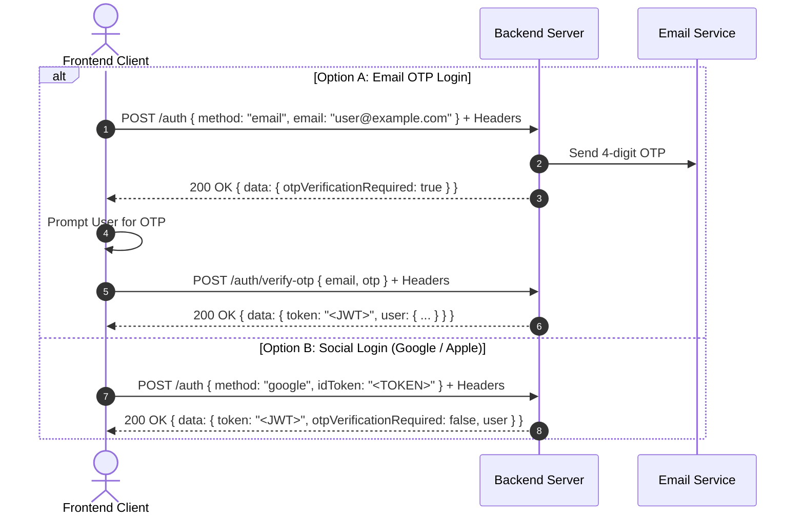
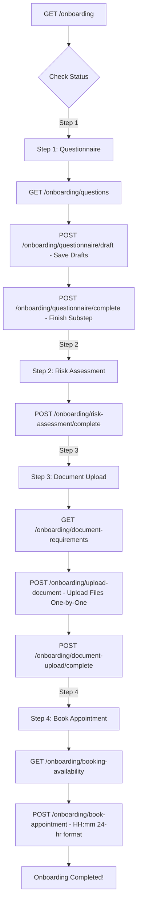

# Frontend Integration Guide (FE Integration Guide)

This document provides a comprehensive integration guide for Frontend developers connecting to the **Watership Backend API**. It covers base URLs, categorized API endpoints, request payloads, required fields, field formatting rules, standard success and error response structures, and step-by-step feature interaction flows.

---

## 1. Base URL & Core Headers

### 1.1 Base URLs
- **Local Development Base URL:** `http://localhost:5000`
- **Swagger Documentation:** `http://localhost:5000/api-docs`
- **Static Assets / Uploaded Files:** `http://localhost:5000/uploads/<filename>` (or `baseUrl` returned in image objects)

### 1.2 Common HTTP Headers

| Header Name | Type | Required | Description | Example |
| :--- | :--- | :--- | :--- | :--- |
| `Content-Type` | String | Depends | `application/json` for standard requests, `multipart/form-data` for file uploads | `application/json` |
| `Authorization` | String | Conditional | Required for protected routes. Format: `Bearer <JWT_TOKEN>` | `Bearer eyJhbGciOiJIUzI1Ni...` |
| `deviceuniqueid` | String | Required for Auth | Unique hardware / app instance ID of the client device | `device_987654321` |
| `devicemodel` | String | Required for Auth | Name / model of the client device | `iPhone 15 Pro` / `Chrome Browser` |

---

## 2. Standard Response Structures

All API responses strictly adhere to a unified JSON response format.

### 2.1 Standard Success Response (200 OK / 201 Created)
```json
{
  "success": true,
  "message": "Operation completed successfully",
  "data": { ... },
  "pagination": {
    "page": 1,
    "limit": 10,
    "total": 45,
    "pages": 5
  }
}
```
*Note: `data` and `pagination` fields are included when relevant.*

### 2.2 Standard Error Response Format
```json
{
  "success": false,
  "message": "Detailed error message explanation"
}
```

### 2.3 Common Error Types & HTTP Codes

| HTTP Code | Error Trigger | Example Response Body |
| :--- | :--- | :--- |
| **400 Bad Request** | Missing required body/header field or invalid schema | `{"success": false, "message": "Email is required for email login/signup"}` |
| **400 Bad Request** | Business validation failure (e.g., missing required doc upload) | `{"success": false, "message": "Cannot complete step — required documents are missing: Passport"}` |
| **401 Unauthorized** | Missing `Authorization` header | `{"success": false, "message": "Unauthorized - No token provided"}` |
| **401 Unauthorized** | Token expired or invalid signature | `{"success": false, "message": "Invalid or expired token. Please re-login."}` |
| **401 Unauthorized** | User account deactivated by Admin | `{"success": false, "message": "Your account has been deactivated by admin. Please contact support for more information."}` |
| **403 Forbidden** | Access restricted (e.g. non-admin accessing admin route) | `{"success": false, "message": "Access denied. Admin privileges required."}` |
| **404 Not Found** | Resource or route endpoint does not exist | `{"success": false, "message": "Can't find /users/999 on the Server"}` |
| **429 Too Many Requests** | Exceeded rate limit (e.g. OTP resend limits) | `{"success": false, "message": "Too many requests, please try again later."}` |
| **500 Internal Error** | Uncaught server error | `{"success": false, "message": "Internal Server Error"}` |

---

## 3. Formatted Fields & Validation Rules

| Field Name | Data Type | Formatting / Validation Rule | Example |
| :--- | :--- | :--- | :--- |
| `email` | String | Lowercase, trimmed, valid email format | `user@example.com` |
| `phone` | String | Trimmed, E.164 phone regex (`^\+?[1-9]\d{7,14}$`) | `+1234567890` |
| `otp` | String | Trimmed, exactly 4 numeric digits (`^\d{4}$`) | `1234` |
| `method` | Enum String | One of: `"email"`, `"google"`, `"apple"` | `"email"` |
| `startTime` / `endTime` | String | 24-hour time format `HH:mm` regex (`^([01]\d\|2[0-3]):[0-5]\d$`) | `"11:00"`, `"12:00"` |
| `bookingDate` | String | Date string `YYYY-MM-DD` | `"2026-05-02"` |
| `substepNumber` | Integer | Positive integer | `1`, `2` |
| `questionType` | Enum String | One of: `"text"`, `"date"`, `"radio"`, `"checkbox"`, `"select"`, `"dropdown"`, `"chips"`, `"number"` | `"radio"` |
| `profilePicture` | Binary File | Uploaded via `multipart/form-data` | File object (`.png`, `.jpg`, `.jpeg`) |
| `file` | Binary File | Uploaded via `multipart/form-data` (image or PDF) | File object (`.pdf`, `.png`) |

---

## 4. API Endpoints Reference - Categorized

---

### Category A: Authentication APIs (`/auth`)

#### A.1 `POST /auth` — Authenticate (Email OTP Request or Social Login)
- **Rate Limit:** 4 requests per 1 minute
- **Headers:** `deviceuniqueid` (Required), `devicemodel` (Required)
- **Request Body (Method: Email):**
  ```json
  {
    "method": "email",
    "email": "user@example.com"
  }
  ```
- **Request Body (Method: Social - Google/Apple):**
  ```json
  {
    "method": "google",
    "idToken": "eyJhbGciOiJSUzI1NiIs..."
  }
  ```
- **Required Fields:**
  - `method` (Required: `"email"` \| `"google"` \| `"apple"`)
  - If `method === "email"`: `email` is Required (Do NOT send `idToken`).
  - If `method === "google" | "apple"`: `idToken` is Required (Do NOT send `email`).
- **Success Response (Email Auth - 200 OK):**
  ```json
  {
    "success": true,
    "message": "OTP sent to email successfully",
    "data": {
      "email": "user@example.com",
      "otpVerificationRequired": true
    }
  }
  ```
- **Success Response (Social Auth - 200 OK):**
  ```json
  {
    "success": true,
    "message": "Authentication successful",
    "data": {
      "token": "eyJhbGciOiJIUzI1Ni...",
      "otpVerificationRequired": false,
      "user": {
        "_id": "66b1a2b3c4d5e6f7a8b9c0d1",
        "email": "user@example.com",
        "isEmailVerified": true,
        "isProfileCompleted": false
      }
    }
  }
  ```
- **Error Responses:**
  - `400 Bad Request`: `{"success": false, "message": "Email is required for email login/signup"}`
  - `400 Bad Request`: `{"success": false, "message": "Device unique id is required"}`

---

#### A.2 `POST /auth/verify-otp` — Verify Email OTP & Login
- **Rate Limit:** 4 requests per 1 minute
- **Headers:** `deviceuniqueid` (Required), `devicemodel` (Required)
- **Request Body:**
  ```json
  {
    "email": "user@example.com",
    "otp": "1234"
  }
  ```
- **Required Fields:** `email`, `otp`, `deviceuniqueid` header, `devicemodel` header
- **Success Response (200 OK):**
  ```json
  {
    "success": true,
    "message": "OTP Verified Successfully",
    "data": {
      "token": "eyJhbGciOiJIUzI1Ni...",
      "otpVerificationRequired": false,
      "user": {
        "_id": "66b1a2b3c4d5e6f7a8b9c0d1",
        "email": "user@example.com",
        "firstName": "John",
        "lastName": "Doe",
        "isEmailVerified": true,
        "isProfileCompleted": true
      }
    }
  }
  ```
- **Error Responses:**
  - `400 Bad Request`: `{"success": false, "message": "Invalid or expired OTP"}`
  - `400 Bad Request`: `{"success": false, "message": "OTP must be a 4 digit number"}`

---

#### A.3 `POST /auth/email-verification-otp` — Resend Email OTP
- **Rate Limit:** 4 requests per 1 minute
- **Request Body:**
  ```json
  {
    "email": "user@example.com"
  }
  ```
- **Required Fields:** `email`
- **Success Response (200 OK):**
  ```json
  {
    "success": true,
    "message": "OTP sent successfully"
  }
  ```

---

#### A.4 `POST /auth/check-email` — Check Email Existence & Verification
- **Request Body:**
  ```json
  {
    "email": "user@example.com"
  }
  ```
- **Required Fields:** `email`
- **Success Response (200 OK):**
  ```json
  {
    "success": true,
    "message": "Check result retrieved",
    "data": {
      "exists": true,
      "isEmailVerified": true
    }
  }
  ```

---

#### A.5 `POST /auth/update-fcm` — Update FCM Push Notification Token
- **Authentication:** Protected (`Bearer <token>`)
- **Request Body:**
  ```json
  {
    "fcmToken": "fcm_token_string_here..."
  }
  ```
- **Required Fields:** `fcmToken`
- **Success Response (200 OK):**
  ```json
  {
    "success": true,
    "message": "FCM token updated successfully"
  }
  ```

---

#### A.6 `POST /auth/logout` — Logout Current Session
- **Authentication:** Protected (`Bearer <token>`)
- **Request Body:** None
- **Success Response (200 OK):**
  ```json
  {
    "success": true,
    "message": "Logged out successfully"
  }
  ```

---

#### A.7 `POST /auth/send-delete-otp` — Send Account Deletion OTP
- **Authentication:** Protected (`Bearer <token>`)
- **Request Body:** None
- **Success Response (200 OK):**
  ```json
  {
    "success": true,
    "message": "OTP for account deletion sent to your email successfully"
  }
  ```

---

#### A.8 `POST /auth/delete` — Confirm Soft Delete Account
- **Authentication:** Protected (`Bearer <token>`)
- **Request Body:**
  ```json
  {
    "otp": "1234"
  }
  ```
- **Required Fields:** `otp`
- **Success Response (200 OK):**
  ```json
  {
    "success": true,
    "message": "Account deleted successfully"
  }
  ```
- **Error Response (400 Bad Request):** `{"success": false, "message": "Invalid or expired OTP"}`

---

### Category B: User Profile Management (`/users`)

#### B.1 `POST /users/complete-profile` — Complete Profile Details
- **Authentication:** Protected (`Bearer <token>`)
- **Content-Type:** `multipart/form-data`
- **Form Data Fields:**
  - `firstName` (Optional)
  - `lastName` (Optional)
  - `phone` (Optional, E.164 string format)
  - `dob` (Optional, `YYYY-MM-DD`)
  - `primaryAddress` (Optional)
  - `profilePicture` (Optional, File)
- **Success Response (200 OK):**
  ```json
  {
    "success": true,
    "message": "User profile completed successfully",
    "data": {
      "user": {
        "_id": "66b1a2b3c4d5e6f7a8b9c0d1",
        "firstName": "John",
        "lastName": "Doe",
        "email": "user@example.com",
        "phone": "+1234567890",
        "dob": "1995-05-15",
        "primaryAddress": "123 Main St",
        "isProfileCompleted": true
      }
    }
  }
  ```

---

#### B.2 `GET /users/me` — Get Current Logged-In User Profile
- **Authentication:** Protected (`Bearer <token>`)
- **Success Response (200 OK):**
  ```json
  {
    "success": true,
    "message": "User retrieved successfully",
    "data": {
      "_id": "66b1a2b3c4d5e6f7a8b9c0d1",
      "email": "user@example.com",
      "firstName": "John",
      "lastName": "Doe",
      "phone": "+1234567890",
      "isEmailVerified": true,
      "isProfileCompleted": true,
      "profilePicture": {
        "_id": "66b1a2...",
        "url": "/uploads/profile-123.jpg"
      }
    }
  }
  ```

---

#### B.3 `PATCH /users` — Update Profile Info
- **Authentication:** Protected (`Bearer <token>`)
- **Content-Type:** `multipart/form-data`
- **Form Data Fields:** `firstName`, `lastName`, `phone`, `dob`, `primaryAddress`, `profilePicture` (File)
- **Success Response (200 OK):** `{"success": true, "message": "User updated successfully"}`

---

#### B.4 `GET /users` — Get All Users (Paginated)
- **Authentication:** Protected (`Bearer <token>`)
- **Query Params:** `page` (default 1), `limit` (default 10)
- **Success Response (200 OK):**
  ```json
  {
    "success": true,
    "message": "Users fetched successfully",
    "data": [ ... ],
    "pagination": { "page": 1, "limit": 10, "total": 25, "pages": 3 }
  }
  ```

---

#### B.5 `GET /users/:id` & `DELETE /users/:id`
- **Authentication:** Protected (`Bearer <token>`)
- **Path Parameter:** `id` (MongoDB ObjectId String)

---

### Category C: User Onboarding Flow (`/onboarding`)

#### C.1 `GET /onboarding` — Get User Onboarding Progress & Config
- **Authentication:** Protected (`Bearer <token>`)
- **Success Response (200 OK):**
  ```json
  {
    "success": true,
    "message": "Onboarding progress retrieved successfully",
    "data": {
      "status": "in_progress",
      "overallPercent": 25,
      "questionnaire": { "status": "in_progress", "completedSubsteps": [1] },
      "riskAssessment": { "status": "not_started" },
      "documentUpload": { "status": "not_started", "uploadedDocuments": [] },
      "booking": { "status": "not_started" }
    }
  }
  ```

---

#### C.2 `GET /onboarding/questions` — Get Questionnaire Steps & Questions
- **Authentication:** Protected (`Bearer <token>`)
- **Success Response (200 OK):** Returns all categories/sub-steps with dynamic questions, types, options, and conditional logic.

---

#### C.3 `GET /onboarding/document-requirements` — Get Required Document Types
- **Authentication:** Protected (`Bearer <token>`)
- **Success Response (200 OK):** Returns configured document requirements for Step 3 (e.g. Passport, Driver's License) with fields `code`, `title`, `required`.

---

#### C.4 `GET /onboarding/booking-availability` — Get Appointment Slots
- **Authentication:** Protected (`Bearer <token>`)
- **Query Param:** `date` (Optional, `YYYY-MM-DD`)
- **Success Response (200 OK):** Returns available locations and time slots.

---

#### C.5 `POST /onboarding/questionnaire/draft` — Save Questionnaire Draft Answers
- **Authentication:** Protected (`Bearer <token>`)
- **Request Body:**
  ```json
  {
    "substepNumber": 1,
    "answers": [
      {
        "questionId": "q_marital_status",
        "value": "Married",
        "conditionalAnswers": [
          { "questionId": "q_spouse_name", "value": "Jane Doe" }
        ]
      }
    ]
  }
  ```
- **Required Fields:** `substepNumber`

---

#### C.6 `POST /onboarding/questionnaire/complete` — Complete Questionnaire Sub-step
- **Authentication:** Protected (`Bearer <token>`)
- **Request Body:**
  ```json
  {
    "substepNumber": 1,
    "answers": [
      { "questionId": "q_marital_status", "value": "Single" }
    ]
  }
  ```

---

#### C.7 `POST /onboarding/risk-assessment/complete` — Complete Step 2 Risk Assessment
- **Authentication:** Protected (`Bearer <token>`)
- **Request Body:** `{ "thirdPartyReference": "ref_1234" }` (Optional)
- **Success Response (200 OK):** `{"success": true, "message": "Risk assessment completed successfully", "data": { "redirectUrl": "..." }}`

---

#### C.8 `POST /onboarding/upload-document` — Upload Single Document (Step 3 One-by-One)
- **Authentication:** Protected (`Bearer <token>`)
- **Content-Type:** `multipart/form-data`
- **Form Data Fields:**
  - `file` (Required, File binary - image/PDF)
  - `fileName` (Required, String - display name, e.g., `passport_copy.pdf`)
  - `type` (Required, String - document requirement `code`, e.g., `passport`)
- **Behavior:** Overwrites previous upload if the same `type` code is sent again.
- **Success Response (200 OK):** Returns updated `uploadedDocuments` list.

---

#### C.9 `POST /onboarding/document-upload/complete` — Complete Document Upload Step
- **Authentication:** Protected (`Bearer <token>`)
- **Request Body:** None
- **Validation:** Verifies all `required: true` document requirement types exist in uploaded documents.
- **Error Response (400 Bad Request):**
  ```json
  {
    "success": false,
    "message": "Cannot complete step — required documents are missing: Passport"
  }
  ```

---

#### C.10 `POST /onboarding/book-appointment` — Book Appointment (Step 4)
- **Authentication:** Protected (`Bearer <token>`)
- **Request Body:**
  ```json
  {
    "bookingDate": "2026-05-02",
    "startTime": "11:00",
    "endTime": "12:00",
    "meetingLocation": "Sarasota Office",
    "isTeamsMeetingRequested": true,
    "notes": "Special instructions"
  }
  ```
- **Required Fields:** `bookingDate`, `startTime` (`HH:mm`), `endTime` (`HH:mm`)

---

### Category D: Billing & Subscriptions (`/billing`)

- `GET /billing/subscription-plans` — Public endpoint to get subscription tiers.
- `POST /billing/subscription-purchase` — Purchase subscription plan.
- `POST /billing/subscription-cancel` — Cancel active subscription.
- `POST /billing/add-card` — Save payment card.
- `GET /billing/cards` — Retrieve user payment cards.
- `POST /billing/default-card/:id` — Set primary default card.
- `POST /billing/delete-card/:id` — Delete card.
- `POST /billing/create-account` — Initialize connected payout account.
- `POST /billing/add-bank` & `DELETE /billing/delete-bank/:id` — Bank account payout setup.
- `GET /billing/transactions` — Get user transaction history with query filters (`page`, `limit`, `startDate`, `endDate`, `status`).

---

### Category E: Notifications (`/notification`)

- `GET /notification/me` — Get logged-in user notifications (`page`, `limit`).
- `GET /notification/count` — Get total unread notifications count.
- `PATCH /notification/read` — Mark notifications as read.
- `POST /notification`, `GET /notification`, `PUT /notification/:id`, `DELETE /notification/:id` — Admin notifications management.

---

### Category F: Settings (`/settings`)

- `GET /settings` — Get application and user settings.
- `PATCH /settings` — Update settings payload.

---

### Category G: Admin Management (`/admin`)

- `POST /admin/login` — Requires `email`, `password`, `deviceuniqueid`, `devicemodel`.
- `POST /admin/forgot-password` — Requires `email`.
- `GET /admin/users` — Paginated user listing with search and filter (`search`, `status`, `isDeactivatedByAdmin`).
- `PATCH /admin/users/:userId/deactivate` — Toggle user account deactivation.
- `GET /admin/dashboard/stats` & `GET /admin/dashboard/insights` — Query parameter `period` (`7d`, `30d`, `90d`, `1y`).
- Onboarding Step & Question Admin Management:
  - `GET /admin/onboarding/steps`
  - `POST /admin/onboarding/steps` (Supports nested `conditionalLogic`)
  - `PATCH /admin/onboarding/steps/:stepId`
  - `DELETE /admin/onboarding/steps/:stepId`
  - `POST /admin/onboarding/steps/:stepId/questions`
  - `PATCH /admin/onboarding/steps/:stepId/questions/:questionId`
  - `DELETE /admin/onboarding/steps/:stepId/questions/:questionId`

---

## 5. Standard Feature Integration Flows

### Flow 1: Authentication & Social Login


### Flow 2: Complete User Profile Setup
1. After login, check `user.isProfileCompleted`.
2. If `false`, redirect user to Profile Setup Screen.
3. User fills out details & selects profile picture.
4. Send `POST /users/complete-profile` as `multipart/form-data`.
5. On success (`200 OK`), backend updates `isProfileCompleted = true`. Store returned user data and navigate to App Dashboard.

### Flow 3: 4-Step Onboarding Workflow


---

*End of Frontend Integration Guide.*
